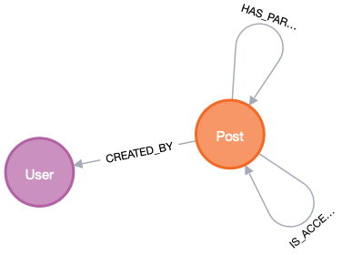

# neo4j-load-parquet

Experiments on loading parquet files

## Build

JDK 17 is required.
Ignore the tons of warnings, it's an experiment

```bash
mvn -Dfast clean package
```

### Running

#### Server side batches (default)

```bash
java -jar target/neo4j-load-parquet-1.0-SNAPSHOT.jar -abolt://localhost:7687 -uneo4j -pverysecret --label=Test ~/tmp/yellow_tripdata_2023-04.parquet
```

#### Client side batches (slow and crappy)

**NOTE**: Client side batches are implemented as a number of statements per transaction. The code is using explicit transactions, using a parameterized query object and relies on the combined driver and server infrastructure to tune this. Right now, buffering statements and then using a halfway decent sized transaction is the only way to do client side batching with the Neo4j Java Driver. If you one needs more, it's through Cypher.  

```bash
java -jar target/neo4j-load-parquet-1.0-SNAPSHOT.jar -abolt://localhost:7687 -uneo4j -pverysecret --mode=CLIENT_SIDE_BATCHING --batch-size=100 --label=Test2 ~/tmp/yellow_tripdata_2023-04.parquet
```

#### As stored procedure

This PoC can also be dropped into the `plugin` folder.
After a server restart a procedure `loadParquet` is available. 
This procedure takes one argument that should look like a URI and tries to resolve that to a Parquet file.
The URI can be a local file with or without `file://` scheme or any - by Java - supported URL. Credentials, headers etc. are not yet supported.
The stored procedure returns a map per row in the parquet file.

```cypher
CALL loadParquet('https://d37ci6vzurychx.cloudfront.net/trip-data/yellow_tripdata_2023-03.parquet') 
YIELD row 
RETURN count(row) as numRows;
```

Or ingest all data for further processing (Note: Downloaded Parquet files are not cached and dl will add to the processing time. Use local files for benchmarking.

```cypher
CALL loadParquet('/Users/msimons/tmp/yellow_tripdata_2023-04.parquet') 
YIELD row 
CALL {
  WITH row 
  CREATE (r:Ride) SET r = row
} IN TRANSACTIONS of 100000 rows;
```

## Misc

### Converting Stackoverflow content to single parquet files

I used the `gis` archive from https://archive.org/details/stackexchange for the following conversion. This takes only posts with a title and an owner id into account.

```bash
# Create intermedia users
xidel -se '//row/[(@Id|@Reputation|@DisplayName)]' Users.xml | jq -r '. | @tsv' | duckdb -c "copy (select * from read_csv_auto('/dev/stdin', names=['user_id', 'user_reputation', 'user_name'])) to 'users.csv' HEADER;"
# Create intermediate posts
xidel -se '//row[string(@Title) and string(@OwnerUserId)]/[(@Id|@CreationDate|@OwnerUserId|@LastActivityDate|@Title)]' posts.xml | jq -r '. | @tsv' | duckdb -c "copy (
  select id, user_id, strftime(created_at, '%Y-%m-%dT%H:%M:%S') AS created_at, strftime(last_activity_date, '%Y-%m-%dT%H:%M:%S') AS last_activity_date, title_or_excerpt 
  from read_csv_auto('/dev/stdin', names=['id', 'created_at', 'user_id', 'last_activity_date', 'title_or_excerpt'], quote='', escape='')
) to '/dev/stdout' HEADER;" > posts.csv
xidel -se '//row[not(string(@Title)) and string(@OwnerUserId)]/[(@Id|@CreationDate|@Body|@OwnerUserId|@LastActivityDate)]' posts.xml | jq -r '. | @tsv' | duckdb -c "copy (
  select id, user_id, strftime(created_at, '%Y-%m-%dT%H:%M:%S') AS created_at, strftime(last_activity_date, '%Y-%m-%dT%H:%M:%S') AS last_activity_date, substring(title_or_excerpt, 0, 32) as title_or_excerpt 
  from read_csv_auto('/dev/stdin', names=['id', 'created_at', 'title_or_excerpt', 'user_id', 'last_activity_date'], quote='', escape='')
) to '/dev/stdout';" >> posts.csv
# Posts with accepted answers
xidel -se '//row[(string(@AcceptedAnswerId)) and string(@OwnerUserId)]/[(@Id|@AcceptedAnswerId)]' posts.xml | jq -r '. | @tsv' | duckdb -c "copy (
  select * from read_csv_auto('/dev/stdin', names=['id', 'accepted_answer_id'])
) to '/dev/stdout' HEADER;" > accepted_answers.csv
# Parents
xidel -se '//row[(string(@ParentId)) and string(@OwnerUserId)]/[(@Id|@ParentId)]' posts.xml | jq -r '. | @tsv' | duckdb -c "copy (
  select * from read_csv_auto('/dev/stdin', names=['id', 'parent_id'])
) to '/dev/stdout' HEADER;" > parents.csv
# Join them together, export to parquet
duckdb -c "COPY (
  SELECT *
    FROM 'posts.csv'
    JOIN 'users.csv' USING (user_id)
    LEFT OUTER JOIN 'accepted_answers.csv' USING (id) 
    LEFT OUTER JOIN 'parents.csv' USING (id)
  ORDER BY ID asc 
) TO 'posts.parquet'"
```

Those can be loaded with `SoLoaderApplication` and will create a schema like this:



### Connect to a relational database and use a query result as input

This will delete all nodes with the label `TestImport` and create as many as there are rows returned by the given query. All columns of the query will be turned into properties.

The example uses In-Memory [DuckDB](https://duckdb.org) for querying the above parquet file as relational table.
Yes, this is stupid, and yes, it is fun too and spares me setting up another database.

Compile as above and adapt your classpath pointing to the JDBC driver for DuckDB accordingly:

```bash
java -cp target/neo4j-load-parquet-1.0-SNAPSHOT.jar:$HOME/.m2/repository/org/duckdb/duckdb_jdbc/0.8.1/duckdb_jdbc-0.8.1.jar \
  org.neo4j.parquet.loader.SQLLoaderApplication \
  --label=TestFromRelational \
  --jdbc-url=jdbc:duckdb: \
  "SELECT * from read_parquet('https://d37ci6vzurychx.cloudfront.net/trip-data/yellow_tripdata_2023-03.parquet') LIMIT 5000"
```
